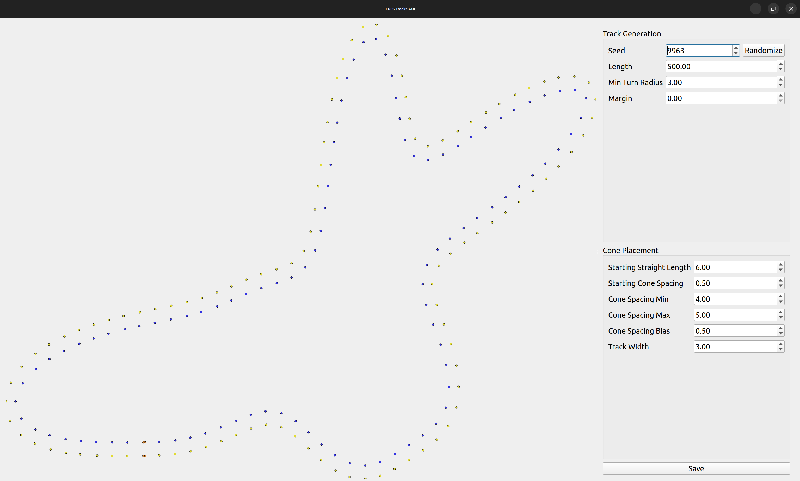
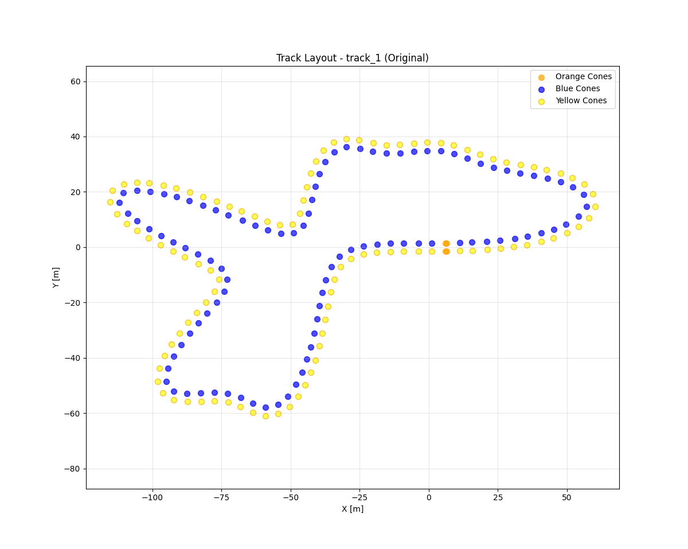
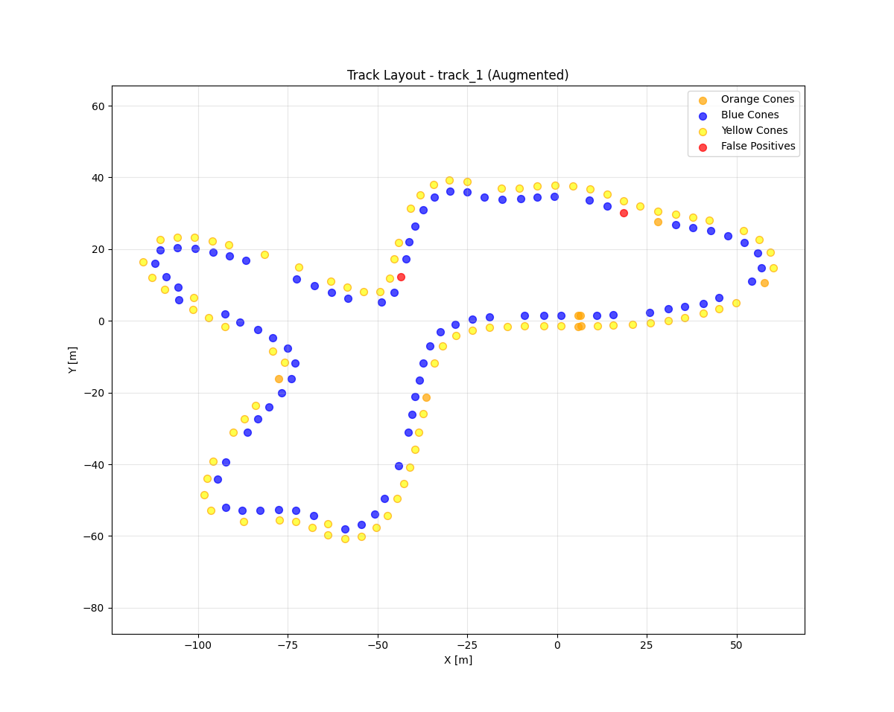
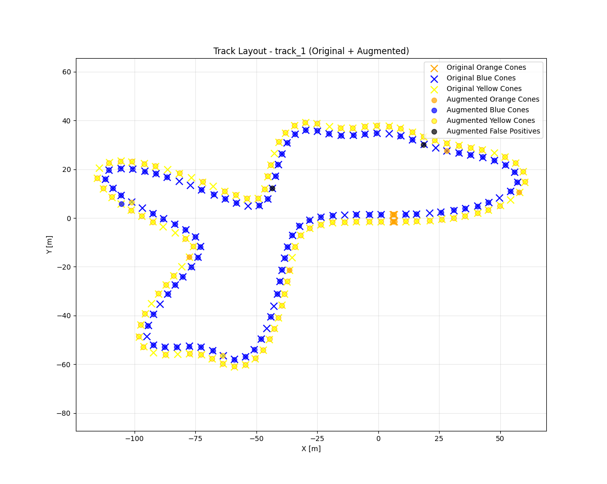

# 🏎️ Track Generator

A simple and Python-friendly track generator, inspired by the [EUFS track generator](https://gitlab.com/eufs/eufs_sim/-/tree/master/eufs_tracks?ref_type=heads).  
This project simplifies the architecture while providing a clean GUI and visualization tools.

---

## 📦 Installation

Create a virtual environment:
```bash
python -m venv venv
```

Install the required libraries:
```bash
pip install -r requirements.txt
```

---

## 🎲 Random Track Generator (with GUI)

This tool comes with a **GUI** for generating and saving tracks.  

Run:
```bash
python src/track_generator_gui.py
```

➡️ A window will open showing:  
- **Track preview** in the main canvas  
- **Control panel** on the right with parameters and actions  

<!-- add screenshot here -->


### ✨ Features
- Adjust track parameters with sliders  
- **Select track type**: closed circuit, open track, or straight line
- **Auto-augmentation**: automatically generate augmented version with each track
- Click **Randomize** to generate a new random track  
- Save tracks to CSV (and NPY) with the **Save** button  

By default, tracks are saved to:
```
./data/generated_tracks
```

When auto-augmentation is enabled, augmented tracks are saved to:
```
./data/augmented_tracks
```

You can change the save directory with:
```bash
python src/track_generator_gui.py --dir <path-to-dir>
```

---

## ⚡ Bulk Track Generation

Skip the GUI and generate multiple tracks at once.  
This mode fixes the parameters but varies the random seed.

Example:
```bash
python src/track_generator_gui.py --dir <path-to-dir> --batch <number-of-tracks>
```

**Auto-augmentation is enabled by default** in batch mode, generating both original and augmented versions automatically.

---

## 👀 Track Visualizer

You can re-open and view saved tracks with the **visualizer tool**.  
The visualizer supports both regular and augmented tracks.

Show all tracks in a directory:
```bash
python src/track_visualizer.py --dir <path-to-dir>
```

Show a specific track:
```bash
python src/track_visualizer.py --dir <path-to-dir> --track_name <track_name>
```

### Visualizing Augmented Tracks

For augmented tracks, you can choose what to display:

```bash
# Show both original and augmented cones (default)
python src/track_visualizer.py --dir ./data/augmented_tracks --mode both

# Show only original cones
python src/track_visualizer.py --dir ./data/augmented_tracks --mode original

# Show only augmented cones
python src/track_visualizer.py --dir ./data/augmented_tracks --mode augmented
```

**Visualization modes:**
- `both` (default) - Overlay original (x markers, faded) and augmented (circles, solid) cones
- `original` - Show only the original cone positions (ground truth)
- `augmented` - Show only the augmented cone positions (with removed cones filtered out)

### Examples

<table>
<tr>
<td width="50%">
<b>Original mode</b><br/>
Ground truth with all cones

</td>
<td width="50%">
<b>Augmented mode</b><br/>
Only valid augmented cones

</td>
</tr>
<tr>
<td colspan="2" align="center">
<b>Both mode</b><br/>
Ground truth vs augmented

</td>
</tr>
</table>

---

## 🔄 Track Augmentation

Apply data augmentation to existing tracks for machine learning training.  
The augmentation tool creates modified versions of tracks with:
- **Random cone removal** - some cones are randomly removed
- **Position noise** - cone positions are slightly randomized
- **Color changes** - cone colors are randomly changed

### Basic usage

Augment all tracks in the default directory:
```bash
python src/track_augmentation.py
```

By default, this reads from `./data/generated_tracks` and saves to `./data/augmented_tracks`.

### Custom directories

Specify input and output directories:
```bash
python src/track_augmentation.py --input_dir <input-path> --output_dir <output-path>
```

### Augmentation parameters

Control the augmentation behavior:
```bash
python src/track_augmentation.py \
  --removal_prob 0.1 \
  --position_noise 0.1 \
  --color_change_prob 0.05 \
  --seed 42
```

**Parameters:**
- `--removal_prob` - Probability of removing each cone (default: 0.1 = 10%)
- `--position_noise` - Standard deviation of position noise in meters (default: 0.1 = 10cm)
- `--color_change_prob` - Probability of changing cone color (default: 0.05 = 5%)
- `--seed` - Random seed for reproducibility (optional)

### Output format

Augmented tracks are saved as CSV files with both original and augmented data:
```
tag,x,y,aug_tag,aug_x,aug_y,is_valid
```

Where:
- `tag`, `x`, `y` - Original cone data (ground truth)
- `aug_tag`, `aug_x`, `aug_y` - Augmented cone data
- `is_valid` - Boolean flag indicating if the cone is present (True) or removed (False)

The `is_valid` field allows you to simulate cone detection failures while keeping the ground truth data for comparison. When visualizing with the track visualizer, only valid cones are shown in the augmented view, while all cones are shown in the original (ground truth) view.

