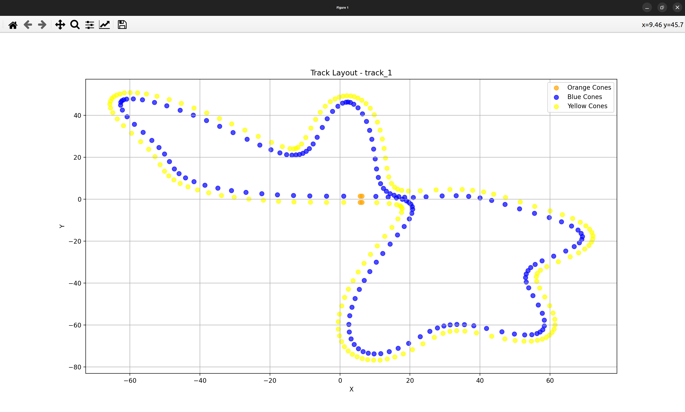

# 🏎️ Track Generator

A simple and Python-friendly track generator, inspired by the [EUFS track generator](https://gitlab.com/eufs/eufs_sim/-/tree/master/eufs_tracks?ref_type=heads).  
This project simplifies the architecture while providing a clean GUI and visualization tools.

---

## 📦 Installation

Create a virtual environment:
```bash
python -m venv venv
```

Install the required libraries:
```bash
pip install -r requirements.txt
```

---

## 🎲 Random Track Generator (with GUI)

This tool comes with a **GUI** for generating and saving tracks.  

Run:
```bash
python src/track_generator_gui.py
```

➡️ A window will open showing:  
- **Track preview** in the main canvas  
- **Control panel** on the right with parameters and actions  

<!-- add screenshot here -->


### ✨ Features
- Adjust track parameters with sliders  
- Click **Randomize** to generate a new random track  
- Save tracks to CSV with the **Save** button  

By default, tracks are saved to:
```
./data/generated_tracks
```

You can change the save directory with:
```bash
python src/track_generator_gui.py --dir <path-to-dir>
```

---

## ⚡ Bulk Track Generation

Skip the GUI and generate multiple tracks at once.  
This mode fixes the parameters but varies the random seed.

Example:
```bash
python src/track_generator_gui.py --dir <path-to-dir> --batch <number-of-tracks>
```

---

## 👀 Track Visualizer

You can re-open and view saved tracks with the **visualizer tool**.

Show all tracks in a directory:
```bash
python src/track_visualizer.py --dir <path-to-dir>
```

Show a specific track:
```bash
python src/track_visualizer.py --dir <path-to-dir> --track_name <track.csv>
```

<!-- add screenshot here -->


